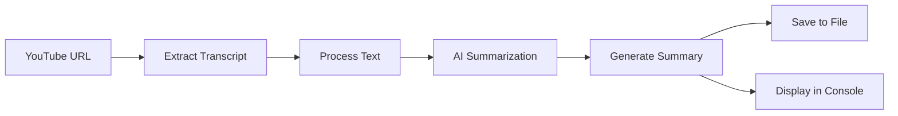

# 🎥 YouTube Video Summarizer

<div align="center">

```
+------------------------------------------+
|     🎥 YouTube Video Summarizer 📝      |
|                                          |
|    Transform Videos into Smart Summaries  |
|        Powered by OpenRouter AI 🤖       |
+------------------------------------------+
```

[](https://opensource.org/licenses/ISC)
[](https://nodejs.org/)
[](https://openrouter.ai/)

A powerful Node.js application that transforms YouTube videos into concise, bullet-point summaries using AI technology.

</div>

## ✨ Features

| Feature | Description |
|---------|------------|
| 🎯 Transcript Extraction | Automatically extracts transcripts from YouTube videos |
| 🤖 AI-Powered Summaries | Uses OpenRouter.ai's GPT-4-mini model for intelligent summarization |
| 💾 Local Storage | Saves summaries to files with timestamps for future reference |
| 🚀 Easy to Use | Simple command-line interface |

## 🛠️ Prerequisites

- Node.js installed on your system
- An OpenRouter.ai API key ([Get one here](https://openrouter.ai/))
- YouTube video URL to summarize

## 📦 Installation

1. Clone the repository:
```bash
git clone https://github.com/bizprat/youtube-summarizer.git
cd youtube-summarizer
```

2. Install dependencies:
```bash
npm install
```

3. Create a `.env` file in the root directory and add your OpenRouter API key:
```env
OPENROUTER_API_KEY=your_api_key_here
```

## 🚀 Usage

1. Open `index.js` and replace the `videoUrl` with your desired YouTube video URL:
```javascript
const videoUrl = 'your-youtube-video-url';
```

2. Run the script:
```bash
node index.js
```

### Example Output Structure

```
📁 youtube-summarizer/
├── 📁 output/
│   └── 📄 summary_VIDEO-ID_2024-02-21T12-30-45-000Z.txt
├── 📄 index.js
├── 📄 .env
└── 📄 package.json
```

## 🔄 How It Works



## 📝 Example Summary

Here's an example of what the summary output looks like:

```
Summary of "Introduction to Node.js":

• Node.js is a JavaScript runtime built on Chrome's V8 engine
• Enables server-side JavaScript execution
• Key features include:
  - Asynchronous & Event-driven
  - Fast execution
  - NPM ecosystem
• Perfect for scalable network applications
```

## 🤝 Contributing

Contributions are welcome! Here's how you can help:

1. Fork the repository
2. Create your feature branch (`git checkout -b feature/AmazingFeature`)
3. Commit your changes (`git commit -m 'Add some AmazingFeature'`)
4. Push to the branch (`git push origin feature/AmazingFeature`)
5. Open a Pull Request

## 📄 License

This project is licensed under the ISC License - see below for details:

```
Copyright (c) 2024

Permission to use, copy, modify, and/or distribute this software for any
purpose with or without fee is hereby granted, provided that the above
copyright notice and this permission notice appear in all copies.

THE SOFTWARE IS PROVIDED "AS IS" AND THE AUTHOR DISCLAIMS ALL WARRANTIES WITH
REGARD TO THIS SOFTWARE INCLUDING ALL IMPLIED WARRANTIES OF MERCHANTABILITY
AND FITNESS. IN NO EVENT SHALL THE AUTHOR BE LIABLE FOR ANY SPECIAL, DIRECT,
INDIRECT, OR CONSEQUENTIAL DAMAGES OR ANY DAMAGES WHATSOEVER RESULTING FROM
LOSS OF USE, DATA OR PROFITS, WHETHER IN AN ACTION OF CONTRACT, NEGLIGENCE OR
OTHER TORTIOUS ACTION, ARISING OUT OF OR IN CONNECTION WITH THE USE OR
PERFORMANCE OF THIS SOFTWARE.
```

## 🌟 Star History

[](https://star-history.com/#bizprat/youtube-summarizer&Date)
